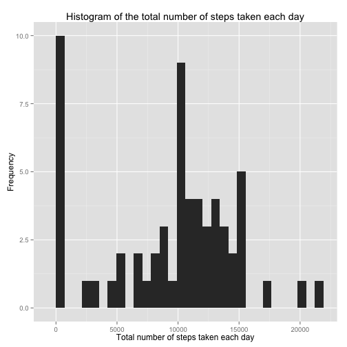
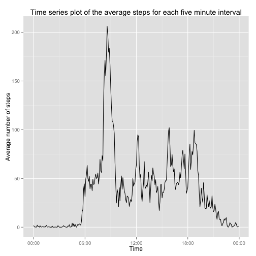
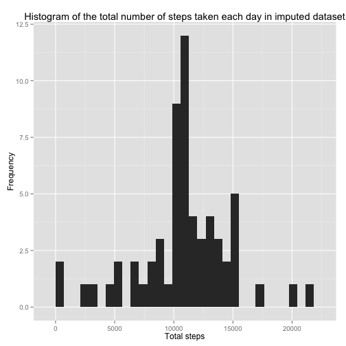
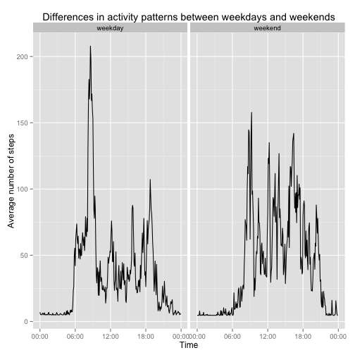

# Reproducible Research: Peer Assessment 1

---


## Loading and preprocessing the data

Load the data.

```r
if(!file.exists("activity.csv")){
  system("unzip activity.zip")
}
data <- read.csv("activity.csv")
```

Create a column to store the date and time.

```r
time <- formatC(data$interval / 100, 2, format="f")
data$date.time <- as.POSIXct(paste(data$date, time),
                             format="%Y-%m-%d %H.%M",
                             tz="GMT")
```

Create a column to store the time only.

```r
data$time <- format(data$date.time, format="%H:%M:%S")
data$time <- as.POSIXct(data$time, format="%H:%M:%S")
```

## What is mean total number of steps taken per day?

Calculate total number of steps taken each day.

```r
total.steps <- tapply(data$steps, data$date, sum, na.rm=TRUE)
```

Make a histogram of the total number of steps taken each day.

```r
library(ggplot2)
qplot(total.steps, 
      xlab="Total number of steps taken each day", 
      ylab="Frequency", 
      main="Histogram of the total number of steps taken each day" )
```

 

Calculate the mean and median total number of steps taken per day.

```r
mean(total.steps)
```

[1] 9354

```r
median(total.steps)
```

[1] 10395

## What is the average daily activity pattern?

Create data for the average steps for each five minute interval.

```r
average.steps <- tapply(data$steps, data$time, mean, na.rm=TRUE)
daily.data <- data.frame(time=as.POSIXct(names(average.steps)),
                         average.steps=average.steps)
```

Create time series plot of the average steps for each five minute interval.

```r
library(scales)
ggplot(daily.data, aes(time, average.steps)) + 
    ggtitle("Time series plot of the average steps for each five minute interval") + 
    geom_line() +
    xlab("Time") +
    ylab("Average number of steps") +
    scale_x_datetime(labels=date_format(format="%H:%M"))
```

 

Which five minute interval has the highest mean number of steps?

```r
max.average.steps <- which.max(daily.data$average.steps)
format(daily.data[max.average.steps, "time"], format="%H:%M")
```

[1] "08:35"


## Imputing missing values
Identify the number of intervals with missing step counts ("NA's"):

```r
summary(data$steps)
```

   Min. 1st Qu.  Median    Mean 3rd Qu.    Max.    NA's 
    0.0     0.0     0.0    37.4    12.0   806.0    2304 

Use average steps for a five-minute interval to impute the missing values.

```r
library(Hmisc)
imputed.data <- data
imputed.data$steps <- with(imputed.data, impute(steps, mean))
```

Histogram of the imputed dataset.

```r
imputed.total.steps <- tapply(imputed.data$steps, imputed.data$date, sum)
qplot(imputed.total.steps, 
      xlab="Total steps", 
      ylab="Frequency",
      main="Histogram of the total number of steps taken each day in imputed dataset")
```

 
Calculate the mean and median steps for each day between the original data set and the imputed data set.

```r
mean(total.steps)
```

[1] 9354

```r
mean(imputed.total.steps)
```

[1] 10766

```r
median(total.steps)
```

[1] 10395

```r
median(imputed.total.steps)
```

[1] 10766

From the above results, we see that imputing the missing data has increased the average number of steps. 

## Are there differences in activity patterns between weekdays and weekends?

Create a column to identify whether a day is a weekday or weekend.

```r
day.type <- function(date) {
  ifelse(weekdays(date) %in% c("Saturday", "Sunday"), "weekend", "weekday")
}
day.types <- sapply(imputed.data$date.time, day.type)
imputed.data$day.type <- as.factor(day.types)
```

Create data calculating the average steps for weekdays and weekends.

```r
average.steps <- tapply(imputed.data$steps,
                        interaction(imputed.data$time,
                                    imputed.data$day.type),
                        mean, na.rm=TRUE)
day.type.data <- data.frame(time=as.POSIXct(names(average.steps)),
                            average.steps=average.steps,
                            day.type=as.factor(c(rep("weekday", 288),
                                                 rep("weekend", 288))))
```

Create plot to see the differences in activity patterns between weekdays and weekends.

```r
ggplot(day.type.data, aes(time, average.steps)) + 
    geom_line() +
    ggtitle("Differences in activity patterns between weekdays and weekends") + 
    xlab("Time") +
    ylab("Average number of steps") +
    scale_x_datetime(labels=date_format(format="%H:%M")) +
    facet_grid(. ~ day.type)
```

 
